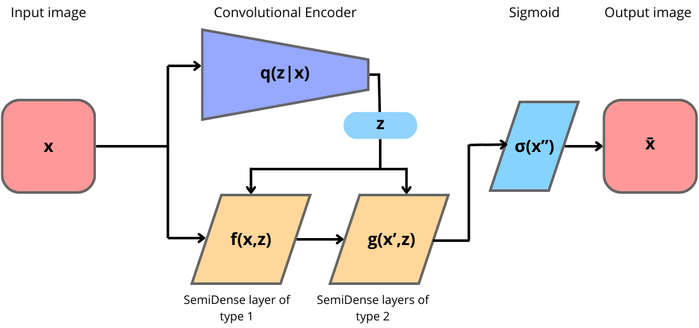

# SarNET: SemiDense Autoregressive Network with VAE

## Table of contents
* [General info](#general-info)
* [Details](#details)
* [Results](#results)
* [Technologies](#technologies)
* [Setup](#installation-and-run)
* [Project Structure](#project-structure)

## General info
Welcome to the SarNET repository! You can find here the source code of SarNET and its extension SarNET with VAE, a novel approach to image generation introduced in my [master's thesis ](SarNET.pdf). These models are based on a multilayer perceptron with masked weights, achieving autoregressive property. SarNET with VAE is trained simultaneously with an encoder in order to make use of vectors from the latent space, enhancing its generation. Additionally, you will find here notebooks containing all the experiments and results. SarNET was implemented using PyTorch, similarly to the Convolutional VAE used as a baseline model.

Below, we present examples of images generated using SarNET VAE. In the first row, you will find images of the digit 5 and various Zalando articles (e.g., T-shirts, trousers, boots, pullovers) from the FashionMNIST dataset, all generated from scratch.

Due to the autoregressive nature of SarNET VAE, it can condition its generation and creatively complete images. The second row displays the reconstructed boot in different styles. On the left, you can see the partially blacked-out image that served as the basis for generation.

|                          |                         |
:-------------------------:|:-------------------------:
  |  
  |  


## Details

The SemiDense layer is a linear layer with masked weights, allowing it to achieve the autoregressive property. It takes a flattened image as an input and process it in parallel, pixel by pixel or patch by patch (depending on the configuration). The patches are subsequent squares of the image and do not overlap. Additionally, connections from all the output neurons to the input latent vector can be added.

SemiDense Autoregressive Network with Variational Autoencoder (SarNET VAE) is an extension of SarNET. It leverages the advantages of a Variational AutoEncoder to enhance the generation process. First, it organizes the latent space
using a Convolutional Encoder. Then, it feeds the input image into a stack of SemiDense layers. Each of the SemiDense layers has additional connections to the latent vector produced by the Convolutional Encoder. The loss function consists of the KLD loss and the reconstruction loss, which is either Binary Cross Entropy or Mean Squared Error.

|          SemiDense layer |    SarNET VAE            |
:-------------------------:|:-------------------------:
  |  

## Results
SarNET is capable of generating high-quality images. We tested it on the generation of the digit 5 using the Frechet Inception Distance (FID) metric. When used with a 128-dimensional latent space, SarNET obtained a lower FID score than VAE.

| Model          | Latent Dim | FID Score |
|----------------|------------|-----------|
| SarNET VAE     | 128        | **1.535** |
| SarNET VAE     | 64         | 1.595     |
| SarNET VAE     | 32         | 1.580     |
| SarNET VAE     | 16         | 1.614     |
| SarNET VAE     | 8          | 2.125     |
| VAE            | 128        | 2.018     |
| VAE            | 64         | **1.565** |
| VAE            | 32         | 1.611     |
| VAE            | 16         | 1.716     |
| VAE            | 8          | 2.876     |
| Simple SarNET  | -          | 29        |

SarNET's predictions are easily interpretable and explainable by inspecting the influence of particular input patches on the outcome. The architecture of the SemiDense layer allows the model to focus more on certain parts of images to make accurate predictions. Each image below shows the five most important patches that the model considers when predicting the value of the white patch. The importance of each patch was measured on a scale of $[0, 1]$. Patches were colored according to their importance.

|           |               |
:-------------------------:|:-------------------------:
  |  

Below we present the interpolation over the latent space between the latent vectors of digits $4$, $5$, and $3$, $4$. Since sarNET is autoregressive, the initial pixels generated have the most significant impact on the model's output. The model generates images in a raster scan order (horizontally left-to-right), making digits with more apparent features at the top easier to generate.

|           |               |
:-------------------------:|:-------------------------:
  |  

## Technologies
* Python 3.10
* PyTorch 2.3.1
* scikit-learn 1.5.0

## Setup
To set up the necessary libraries, run the following command from the main project folder:

```
conda create --name transformer_env python=3.10
conda activate transformer_env
pip install -r requirements.txt
```

## Project Structure

```
sarNET/
├── data/                   # mnist data in numpy arrays
├── docs                    # Documentation folder
├── src/                    # source code for SarNET
├── SarNET.pdf              # The master thesis with SarNET
├── fid.ipynb               # notebook with analysis of FID metric
├── generative_xgboost.ipynb # initial idea of generative xgboost
├── sarnet.ipynb            # experiments with SarNET using digit 5 images
├── sarnet_vae.ipynb        # experiments with SarNET VAE using digit 5 images
├── sarnet_vae-fashion_mnist.ipynb  # experiments with SarNET VAE using fashionMNIST dataset
├── vae.ipynb               # experiments with convolutional VAE digit 5 images
├── .gitignore              # Git ignore file
├── LICENSE                 # License file
└── README.md               # Project README file
```